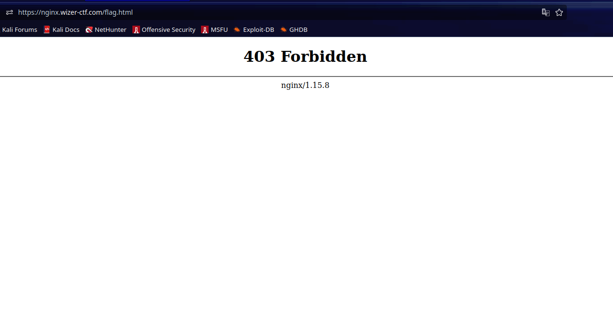
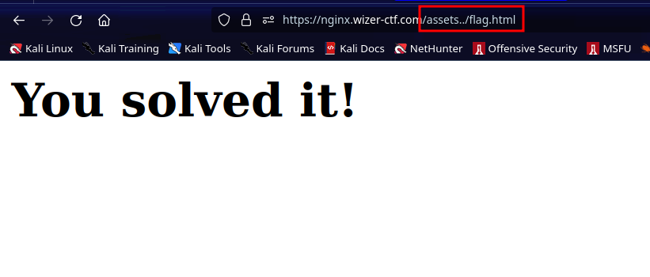

# Nginx Configuration

## Description

Through the Shelldon Cooper's flag game website, with the following nginx configuration, get the flag from `flag.html`.

## Source Configuration

```plaintext
user  nginx;
worker_processes  1;
events {
    worker_connections  1024;
}

http {
    include       /etc/nginx/mime.types;
    default_type  application/octet-stream;
    sendfile        on;
    keepalive_timeout  65;

    server {
        listen       80;
        server_name  localhost;

        location / {  # Allow the index.html file to be read
            root   /usr/share/nginx/html;
            index  index.html;
        }

        location /assets {  # Allow the assets to be read
            alias /usr/share/nginx/html/assets/;
        }

        location = /flag.html {  # The flag file is private
            deny all;
        }

        error_page   500 502 503 504  /50x.html;
        location = /50x.html {
            root   /usr/share/nginx/html;
        }
    }
}
```

## Solution

### Understanding the configuration

First we know that the application is running on `nginx`, and we know that the root directory of this app is in `/usr/share/nginx/html` as stated in this block :

```
location / {  # Allow the index.html file to be read
            root   /usr/share/nginx/html;
            index  index.html;
        }
```

now we move to the next block :

```
location /assets {  # Allow the assets to be read
            alias /usr/share/nginx/html/assets/;
        }
```

This block defines a location directive for URIs starting with `/assets`. It uses the alias directive to map the URI to a local directory on the server file system, in this case, `/usr/share/nginx/html/assets/`. This configuration allows nginx to serve assets (like images, stylesheets, or scripts) located in that directory when a client requests a URI starting with `/assets`.

and finally we have this block :

```
location = /flag.html {  # The flag file is private
            deny all;
        }
```

This defines a location directive for the exact URI `/flag.html`. 

The `deny all;` directive denies access to this specific file for all clients. In other words, if someone tries to access `/flag.html` directly through their browser or any other means, nginx will respond with a `403 Forbidden` error, indicating that access is not allowed, We can confirm that by requesting `/flag.html` :



### Solving the challenge

Since the path `/assets` uses the alias directive to map the URI to a local directory, we can perform a trick which is `directory traversal` to traverse to our target file which is `/flag.html`.

If we specify something like this in the URL : `/assets../flag.html`, in the backend, nginx will replace `/assets` with it's alias and the path would become `/usr/share/nginx/html/assets/../flag.html`, with that we will fetch the file without getting the `403 Forbidden` error.

let's try it out :



And we solved the second challenge!
